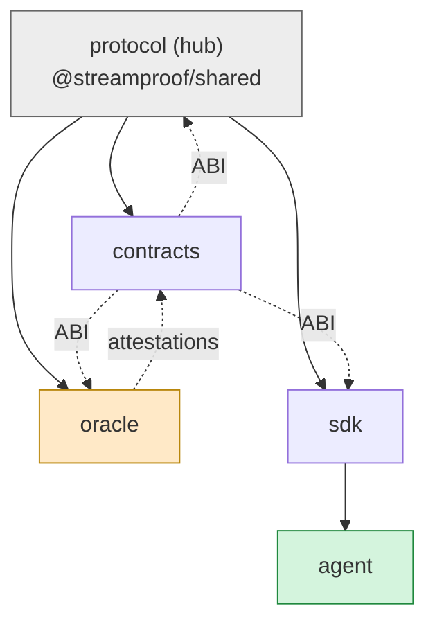

# StreamProof Cross-Repo Roadmap

The single map of how the five repos fit together, what blocks what, and — most
importantly — **exactly how much to build for the prototype.**

## Dependency spine

**Unblock order:** publish `@streamproof/shared` (protocol) → consumers wire it →
deploy escrow (contracts) → oracle/SDK target a real escrow → agent builds on the SDK.

## The phases (across all repos)

- **P0 Foundation** — interface, repo baselines, threat model, deploy strategy. *(largely done)*
- **P1 Prototype** — one verified Akash stream on Base Sepolia, end to end. *(now)*
- **P2 Hardening & Multi-chain** — verifier ladder (threshold + dispute), audit pkg, fees, guardian, receipts, Solana payout, more adapters.
- **P3 Scale** — decentralized verifier network (AVS/CRE), native Solana, Cosmos/FVM, multi-service orchestration.

---

## 🎯 The prototype cut-line — *how much to build now*

**Definition of the prototype (the only thing that matters for the month-one demo):**

> A developer opens a verified Akash compute stream on Base Sepolia through the SDK.
> The oracle posts delivery attestations; the escrow accrues USDC only for verified
> time; two consecutive failures pause accrual; the buyer reclaims unspent funds.
> A thin demo surface shows it. **That's the whole prototype.**

### ✅ DO for the prototype (in order)

| Repo | Issues | Why |
|------|--------|-----|
| protocol | #5 publish `@streamproof/shared` | unblocks every consumer |
| contracts | #3 deploy script ✅ done · #4 ABI artifact · **run the live Base Sepolia deploy** | a real escrow to target |
| oracle | #2 Akash spike · #3 Akash adapter · #4 discovery+store · #5 signer+submitter · #6 e2e loop · #7 consume shared | the verifier loop |
| sdk | #2 consume shared · #3 client · #4 `hireAkashCompute` · #5 status/claim/reclaim · #9 examples | the developer entry + demo driver |
| agent | *(none required)* — spend mandates already exist | — |

That's ~16 issues. A single env-key signer on **testnet is acceptable** for the
prototype (it's the v1 accepted risk).

### 🟡 Stretch (only if the core demo is solid) — the investor "wow"
- agent #5 (MCP server) **or** agent #4 (x402 scheme) + agent #8 (example agent) —
  "an AI agent hires a GPU and pays per verified second." High narrative value;
  not required to prove the protocol works.

### ⛔ DEFER (post-prototype — do NOT build now)
- **Oracle ladder** (Turnkey/Lit/AVS/CRE, TEEs) — oracle #8–#10. Single signer is fine for the demo.
- **Multi-chain / Solana / Cosmos / FVM** — protocol #4, sdk #7, contracts #11–#12. Base only.
- **Fees, guardian, SLA receipts, threshold verifier, audit pkg** — contracts #6–#10.
- **More adapters (io.net, Aethir)** — oracle #12–#13. Akash only.
- **Frameworks, signed mandates, gas abstraction, observability** — agent #6–#7/#3, sdk #8, oracle #11.
- **Whitepaper** — do it *in parallel* for fundraising, but it doesn't block the demo.

**Rule of thumb:** if an issue isn't on the "DO" list, it is not part of the
prototype. Resist scope creep — the demo's value is *proving the loop works*, not
breadth.

---

## After the prototype
Pick the next phase by what fundraising/pilots need: usually (1) the agent wedge
(x402/MCP) for the narrative, then (2) the verifier ladder for credibility, then
(3) multi-chain for reach. See each repo's P2/P3 issues.
