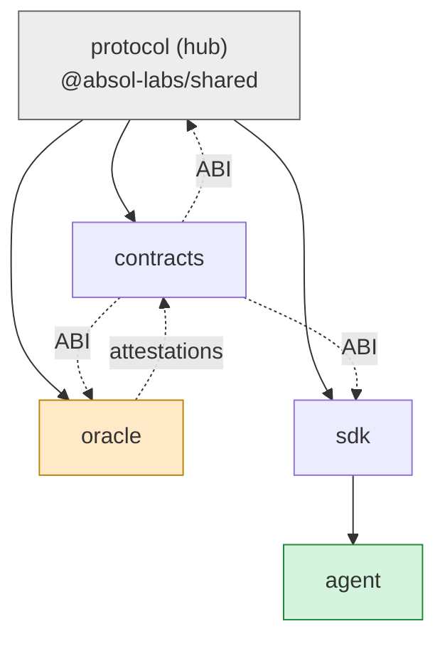

# Metrik Cross-Repo Roadmap (Model A)

How the repos fit together and what to build now. **Model A:** Metrik is an infra-agnostic
verified-service marketplace and payment rail for AI agents, single-chain (Base, USDC). The
canonical plan is
[metrik-protocol/docs/master-plan.md](https://github.com/Absol-Labs/metrik-protocol/blob/main/docs/master-plan.md);
this file tracks the cross-repo build sequence.

## Dependency spine

```mermaid
flowchart TD
    P["protocol (hub)<br/>@absol-labs/shared"] --> C[contracts]
    P --> O[oracle]
    P --> S[sdk]
    C -. ABI .-> P
    C -. ABI .-> O
    C -. ABI .-> S
    S --> A[agent]
    O -. attestations .-> C
    style P fill:#ededed,stroke:#666
    style O fill:#ffe9c7,stroke:#b8860b
    style A fill:#d4f4dd,stroke:#1f883d
```

The unblock order follows the spine: publish `@absol-labs/shared` (protocol), wire it into the
consumers, deploy the escrow (contracts), point the oracle and SDK at the real escrow, and build
the agent layer on the SDK.

## Status

Live end-to-end on **Base Sepolia** (chainId 84532) — real escrow, real oracle, real compute,
metered USDC accrual, testnet only. The hardened production escrow (protocol fee, guardian,
SLA-receipt, M-of-N verifier) is **deployed and Basescan-verified** at
`0x21948a5E6AE8d9A3D1050791AB6138657Fb54286` and powers the live flow. A checkpoint-settlement
variant, `StreamEscrowV2` (`0x0f09f36Ccc05A7c9882F438721C08De314dFd46C`), is deployed and
verified but **not yet wired** into the live flow. Packages are published on npm:
`@absol-labs/shared` 0.8.0, `@absol-labs/sdk` 0.5.1, `@absol-labs/agent` 0.3.2.

## Verification ladder — where each layer stands

The five verification layers are the product's spine, and their honest status is the roadmap.
L1–L3 run continuously; L4 exists on-chain but is federated; L5 is armed. Decentralizing L4 and
exercising L5 in the live flow are the moves that turn the current v1 into a trust-minimized
network.

| Layer | Status |
|-------|--------|
| L1 hardened probe (liveness / latency / schema + canary + nonce + randomized timing) | **Live** |
| L2 consumer zkTLS (Reclaim, buyer-side) | **Live** |
| L3 redundant re-execution sampling | **Live** (single-vantage today) |
| L4 M-of-N staked multi-vantage verifier | **Live but federated** (2-of-3, single operator) |
| L5 optimistic dispute + slashing (UMA OOv3) | **Deployed / armed** |

## Build now (`phase:p2`)

The near-term work hardens the verifier and stands up the marketplace. On verification:
per-serviceRef target resolution (the multi-seller unblocker), auto-close on repeated failure to
bound downtime exposure, and making consumer zkTLS first-class as dispute evidence. On the
marketplace: operator listings, reputation-ranked discovery, and the verified on-chain reputation
index. On the agent path and economics: the hire→stream→settle end-to-end flow, caller
authentication, and the SLA bond. Wiring `StreamEscrowV2` into the live flow and keeping the ABI
in sync across consumers rounds out the contract work.

## Moat next (`phase:p3`)

Decentralize L4 into a staked, multi-vantage, multi-operator verifier network; exercise L5
optimistic disputes with slashing in the live flow; expand L3 re-execution sampling beyond a
single vantage; and add service categories and benchmarking so reputation is comparable across
sellers. The moat is the neutral verifier plus the SLA/reputation dataset — not the escrow, which
is table stakes.

## Deprecated / parked — off the critical path

Cross-chain and multi-chain settlement, per-network deep adapters (io.net, Aethir, AEP-64), and
multi-network orchestration are **closed under Model A**. The verifier is an infra-agnostic HTTP
probe, so no per-network code is required; these reopen only if Metrik ever expands beyond
single-chain Base.

**Rule of thumb:** if an issue is not `phase:p2`, it is not part of the current build. The value
being proven is the verified-delivery loop plus the marketplace — not breadth.
