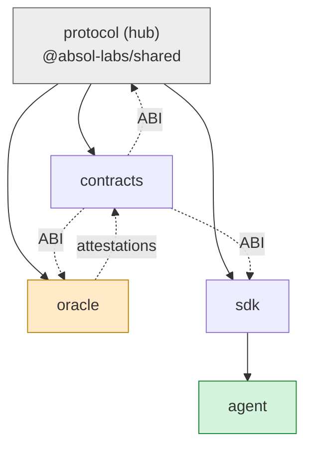

# Metrik Cross-Repo Roadmap (Model A)

How the repos fit together and what to build now. **Model A:** Metrik is an infra-agnostic
**verified service marketplace + payment rail for AI agents**, single-chain (Base, USDC).
Canonical plan: [metrik-protocol/docs/master-plan.md](https://github.com/Absol-Labs/metrik-protocol/blob/main/docs/master-plan.md).

## Dependency spine

```mermaid
flowchart TD
    P["protocol (hub)<br/>@absol-labs/shared"] --> C[contracts]
    P --> O[oracle]
    P --> S[sdk]
    C -. ABI .-> P
    C -. ABI .-> O
    C -. ABI .-> S
    S --> A[agent]
    O -. attestations .-> C
    style P fill:#ededed,stroke:#666
    style O fill:#ffe9c7,stroke:#b8860b
    style A fill:#d4f4dd,stroke:#1f883d
```

**Unblock order:** publish `@absol-labs/shared` (protocol) → consumers wire it → deploy
escrow (contracts) → oracle/SDK target the real escrow → agent builds on the SDK.

## Status

Live end-to-end on **testnet** (real escrow + oracle + real Akash compute + metered USDC
accrual). The hardened escrow (fee / guardian / SLA-receipt / M-of-N verifier) is built,
but the deployed testnet escrow is the older pre-quorum build **pending a redeploy**.

## Build now (Model A, `phase:p2`)

- **Verification hardening:** canary known-answer (oracle#49), nonce + randomized probing
  (oracle#50), per-serviceRef resolution (oracle#51), auto-close on failure (oracle#52),
  consumer zkTLS first-class (agent#24).
- **Marketplace & reputation:** operator listings (site#13), reputation-ranked discovery
  (site#37), verified reputation index (protocol#38, promotes #25).
- **Agent path & economics:** hire→stream→settle E2E (agent#13), caller-auth (agent#21),
  protocol fee (contracts#8, done), SLA bond (contracts#22).
- **The escrow redeploy** + ABI resync (protocol#9).

## Moat next (`phase:p3`)

Decentralized staked multi-vantage verifier (oracle#54), optimistic dispute + slashing
(contracts#26), redundant re-execution sampling (oracle#53), service categories +
benchmarking (protocol#39).

## Deprecated / parked — off the critical path, NOT committed

Cross-chain / multi-chain settlement (protocol#4, contracts#11/#12, sdk#7), per-network
deep adapters (io.net / Aethir / AEP-64 — oracle#12/#13/#31), and multi-network
orchestration (agent#10) are **closed under Model A**; reopen only if we ever expand beyond
single-chain.

**Rule of thumb:** if an issue isn't `phase:p2`, it is not part of the current build. The
value is proving the verified-delivery loop + the marketplace, not breadth.
